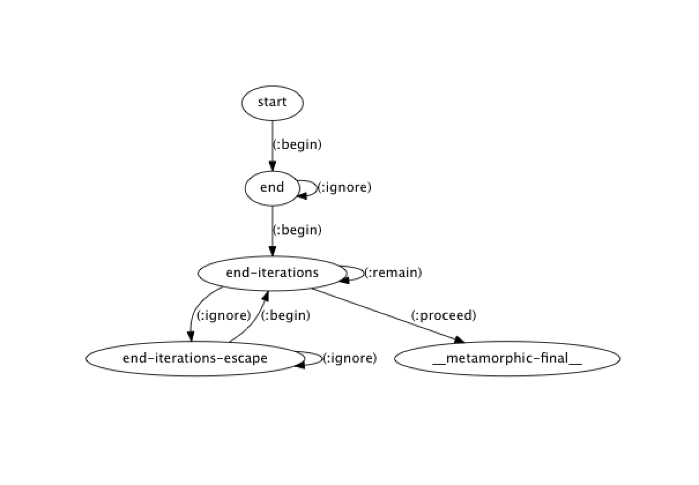
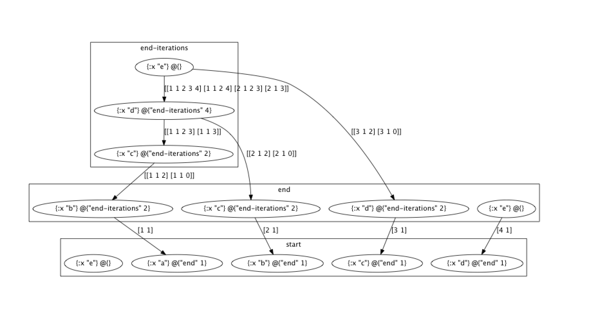

# Metamorphic

Metamorphic is a complex event processing library for Clojure and ClojureScript. Complex event processing is a technique for finding sequences of events that match a particular pattern in a stream.

This library includes:

- Multiple levels of event contiguity (strict, skip till next, skip till any)
- Support for optional patterns
- Support for kleene closure (looping)
- Time-windowed constraints
- Partial match recovery mid-execution
- Access to timed out pattern matches
- A textual tracer
- A visual debugger
- Data and code-level APIs

## Install

```clojure
[org.onyxplatform/metamorphic "0.1.0-alpha1"]
```

## What is this?

Metamorphic accepts *pattern sequences* and compiles them into a *runtime*.
You feed events into the runtime one at a time, and Metamorphic will try to conform
each event into the pattern sequence you defined, taking into account every other
event you've ever fed into it. Pattern sequences are a linear collection of individual patterns.
A single pattern is essentially a predicate - a function that denotes whether the pattern *accepts*
a given event. When all of the patterns in a pattern sequence have accepted an event, in the order they are defined,
a *match* is created, which is the sequence of events that conform to the pattern sequence.

Metamorphic provides facilities to sort out irrelevant events, higher level constructs for looping,
and the ability to look at the history of a match as it happens. It does all of this by using a memory
efficient technique based on academic research (see the Prior Art section). We'll dive into all of these topics in the
Usage guide.

## Quick start

CEP has many concepts. We'll start with a quick example to try and familiarize you with the most important ones.
Patterns can express any predicate you'd like, making them ideal for solving sophisticated, domain-specific problems.
For the purposes of learning, however, we'll use the simplest example possible: matching a pattern of letters.
Let's jump right into code, with comments along the way.

```clojure
;; First we bring in the Metamorphic API and it's runtime.
;; The runtime is a data structure that we'll continually pass
;; to the API functions.

(ns my.metamorphic-trial
  (:require [metamorphic.api :as m]
            [metamorphic.runtime :as rt]))

;; Next, we define predicate functions that take exactly 4 arguments.
;; These predicates are obviously incredibly boring, but they help
;; save your brain power for the real concepts.

;; Each predicate will receive each event as it arrives, a history (which we'll discuss later),
;; the entire pattern sequence, and the particular pattern that this predicate
;; is being used in. This is helpful for parameterizing a predicate.

(defn a? [event history pattern-sequence pattern]
  (= event "a"))

(defn b? [event history pattern-sequence pattern]
  (= event "b"))

(defn c? [event history pattern-sequence pattern]
  (= event "c"))

;; Now let's create a pattern sequence. We're looking for "a", "b", then "c".
;; This pattern says: find "a", then immediately look for "b". After you find "b",
;; look for "c", but if there's something that doesn't match in the middle, that's
;; okay. The relaxation of looking for "c" is called a contiguity constraint, denoted
;; by "followed-by" instead of "next".
(let [runtime (-> (m/new-pattern-sequence "a b c")
                  (m/begin "a" a?)
                  (m/next "b" b?)
                  (m/followed-by "c" c?)
                  (rt/initialize-runtime))
      events ["a" "b" "q" "c" "z"]]
  (:matches (reduce rt/evaluate-event runtime events)))
```

Executing this code will produce:

```clojure
[("a" "b" "c")]
```

As you can see, you basically create a runtime, then run it against some events
to create matches. In this case, we've reduced over a collection, but you can just
as easily use a core.async channel for input as well. In the rest of this guide,
we'll go through all the different kinds of patterns you can express, and the nuances of
how to use Metamorphic.

## Usage

### Contiguity

Contiguity, also known as an *event selection strategy*, is the policy for how to select relevant events from an input stream that has irrelevant events mixed into it. Changing the contiguity lets you filter out noise in a stream. Metamorphic provides 3 levels - strict, skip till next, and skip till any.

#### strict

Selected events must be contiguous in the input stream, otherwise the match is aborted.

##### Example

Given the sequence `["a" "b" "a" "c" "b"]`, and the pattern:

```clojure
(-> (new-pattern-sequence "test")
    (begin "matches-a" (fn [event & context] (= event "a")))
    (next "matches-b" (fn [event & context] (= event "b"))))
```

Will result in a match on `["a" "b"]`, but will ignore the last 3 events because there's a `"c"` in the middle of `"a"` and `"b"`.

#### skip till next

Irrelevant events are skipped until a relevant event is encountered.

##### Example

Given the sequence `["a" "c" "b" "a" "d"]`, and the pattern:

```clojure
(-> (new-pattern-sequence "test")
    (begin "matches-a" (fn [event & context] (= event "a")))
    (followed-by "matches-b" (fn [event & context] (= event "b"))))
```

Will result in a match on `["a" "b"]`. This level of contiguity skips us over `"c"` without aborting the match.

#### skip till any

Irrelevant events are skipped until an relevant event is encountered, but the pattern will continue to match at the same state thereafter.

##### Example

Given the sequence `["a" "b" "c" "d"]`, and the pattern:

```clojure
(-> (new-pattern-sequence "test")
    (begin "matches-a" (fn [event & context] (= event "a")))
    (followed-by-any "any" (constantly true)))
```

Will result in matches: `[["a" "b"] ["a" "c"] ["a" "d"]]`.

### Optional patterns

A pattern can be marked as optional, thus allowing it to match, but making the runtime tolerant to omitting it in matches.
The following will match `["a" "b" "c"]`, or `["b" "c"]`:

```clojure
(-> (new-pattern-sequence "test")
    (begin "a" (fn [event & context] (= event "a") {:optional? true}))
    (followed-by "b" (fn [event & context] (= event "b")))
    (followed-by "c" (fn [event & context] (= event "c"))))
```

### Looping

An individual pattern may be marked as a looping pattern - meaning that it will continue to match as long as a given condition is true.
Turn a *singleton* pattern into a *looping* pattern by specifying `{:repetition :one-or-more}` in its options:

```clojure
(-> (new-pattern-sequence "test")
    (begin "a" (fn [event & context] (= event "a")))
    (followed-by "b's" (fn [event & context] (= event "b")) {:repetition :one-or-more}))
```

This pattern will match an `"a"` followed by one or more `"b"`s. Adding `:optional` will make the pattern match zero or more instances.

### Inter-loop contiguity

Metamorphic supports alternative contiguity modes inbetween loop iterations. Specifying `{:consecutive? true}` makes loop iterations act with `next` contiguity - all iterations must match sequentially. Specifying `{:allow-combinations? true}` makes loop iterations act with `followed-by-any` contiguity. If unspecified, iterations act with `followed-by` contiguity.

### Cleaning up matches

Metamorphic  aims to be as pure as possible. Each time `evaluate-event` is invoked, you pass your instance of the runtime to it, and Metamorphic returns an updated version of that runtime back to you. If there are any new matches, Metamorphic appends them to the `:matches` key in the runtime. You are responsible for removing matches from that key after each invocation of the runtime. If the matches are not removed by your program, Metamorphic will continue to append to the `:matches` sequence without removing the previous matches.

Partial matches that timed out due to missing their window constraints follow the same pattern - except the key is `:timed-out-matches`.

### Time-windowed constraints

Metamorphic supports the ability to force a match to occur within a given time interval. With the code level API, this is expressed with `(api/new-pattern-sequence {:within ms})`, where ms represents a duration in milliseconds of the first event to be matched. With the data level API, simply add the key `:pattern-sequence/within` to your pattern sequence data structure with the same value.

For example, to express that a match must occur within a window of 15 minutes, you would create the pattern with a window of `900000` milliseconds. Metamorphic doesn't use the wallclock to assume what time it is. You supply the current timestamp as an extra parameter to `(rt/process-event)`. This timestamp is intended to be a function of the data you will be passing in.

Any partial matches that time out due to exceeding the window are placed under the `:timed-out-matches` key in the runtime, which you are responsible for clearing out after each runtime iteration.

### Partial match history

Sometimes, it's useful for a predicate to look at all of the events that have been matched thus far. Note that predicates have the following signature:

```clojure
(defn f [event history pattern-sequence pattern])
```

The second parameter, `history`, is a `delay`. When dereferenced, it will return a map of pattern name to collection of events. Thus, you can look behind you during a match and decide what to do given what has happened until now in the stream. Looking up the history does have a cost associated with it, which is why it's in a `delay`, so use this with care.

### Textual tracing

Not sure why your events won't match your pattern? Metamorphic can show all partial matches for a data set:

```clojure
(:require [metamorphic.trace :as t])

(t/trace-partial-match-history <pattern-sequence> <events>)
```

Along similar lines, you can also get a breakdown of the patch that all successful matches took through the runtime:

```clojure
(t/trace-match-history <pattern-sequence> <events>)
```

### Data and code level APIs

While we have written this README to provide examples via the code level API, Metamorphic also supports a data level API. Supply an appropriate data structure to `initialize-runtime`. This README will not go into the specification of the data API at this time, but there are Clojure spec's provided to enforce the correct structure. The code level API's simply build up these data structures, so you can print it out and have a look at any time before calling `initialize-runtime` to get an idea of how it works. It's pretty idiomatic Clojure under the hood as far as data API's go.

### Visual debugging

Metamorphic's implementation uses a static machine and a compact data structure representation to minimize memory overhead. To debug Metamorphic's compilation of your pattern sequence, ensure that you have Graphiz installed, then bring in the following:

```clojure
(:require [metamorphic.validation :as v])
```

Given the following pattern, display a visualization of the compiled state machine:

```clojure
(let [runtime (-> (new-pattern-sequence "test")
                    (begin "start" (constantly true))
                    (followed-by "end" (constantly true) {:repetition :one-or-more})
                    (rt/initialize-runtime))
        events [{:x "a"} {:x "b"} {:x "c"} {:x "d"} {:x "e"}]
        {:keys [matches match-buffer nfa]} (reduce rt/evaluate-event runtime events)]
    (v/visualize-nfa nfa))
```



For a similar effect, you can also visualize the contents of the match buffer. The following won't display much
for the previous example given that we aggressively clean up the match buffer when matches are found, but this is what you'd see
if the match buffer weren't purged:

```clojure
(v/visualize-match-buffer match-buffer)
```



## Prior Art

This implementation is primarily based on the paper [Efficient Pattern Matching over Event Streams](https://people.cs.umass.edu/~yanlei/publications/sase-sigmod08.pdf).

## License

Copyright © 2017 Distributed Masonry

Distributed under the Eclipse Public License either version 1.0 or (at
your option) any later version.
